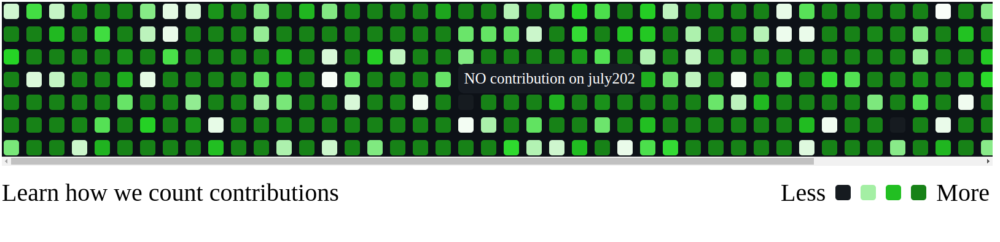

# UiSocial



## How to apply

<github-contributors [config]="config" [data]="data"></github-contributors>
```typescript

  /**
   * @endDate enter the end date in YYYY-MM-DD
   * @startDate enter the start date in YYYY-MM-DD
   * @footerTitle enter the footer title in string format
   * @gridColor sets the color when there no count value enter in string format
   * @gridHue enter hue in number format between 0 - 255
   * @gridBackgroundColor set the main container color of grid
   * @tooltipBackgroundColor set the background color for tooltip
   * @tooltipTextColor set the test color for tooltip
   */
config = {
    endDate: '2024-12-19', 
    startDate: '2023-12-19',
    footerTitle: 'Learn how we count contributions',
    gridColor: '#161B20',
    gridBackgroundColor: '#0D1117',
    tooltipBackgroundColor: '#161b22',
    tooltipTextColor: '#ffffff',
    gridHue: 120
  }
// data object should follow the object pattern 
  data = {
    'yyyy-mm-dd':{count:50,tootltipText:"Your contribution"},
     'yyyy-mm-dd':{count:100,tootltipText:"Your contribution"},
  }


